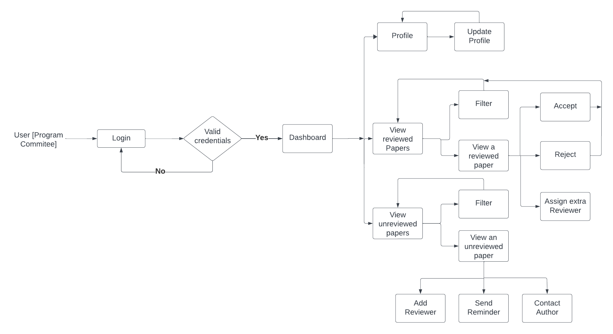

# Software Requirements Specification

For NITCONF

Version 1.0 approved 

Prepared by Johann B Simon, Rajnesh B and Joel Joseph.

# Table of Contents

* [Revision History](#revision-history)
* [Introduction](#1-introduction)
  * 1.1 [Purpose](#11-purpose)
  * 1.2 [Intended Audience](#12-intended-audience)
  * 1.3 [Product Scope](#13-product-scope)
  * 1.4 [References](#14-references)
* [Overall Description](#2-overall-description)
  * 2.1 [Product Overview](#21-product-overview)
  * 2.2 [Product Functions](#22-product-functions)
  * 2.3 [User Classes and Characteristics](#23-user-classes-and-characteristics)
  * 2.4 [Operating Environment](#24-operating-environment)
  * 2.5 [Design and Implementation Constraints](#25-design-and-implementation-constraints)
  * 2.6 [User Documentation](#26-user-documentation)
  * 2.7 [Assumptions and Dependencies](#27-assumptions-and-dependencies)
* [System Features](#3-system-features)
  * 3.1 [Login and Validation](#31-login-and-validation)
  * 3.2 [Profile](#32-profile)
  * 3.3 [Dashboard](#33-dashboard)
  * 3.4 [View-Reviewed-Paper](#34-view-reviewed-paper)
  * 3.5 [View-Unreviewed-Papers](#35-view-unreviewed-papers)
* [Other Nonfunctional Requirements](#4-other-nonfunctional-requirements)
  * 4.1 [Performance Requirements](#41-performance-requirements)
  * 4.2 [Safety Requirements](#42-safety-requirements)
  * 4.3 [Security Requirements](#43-security-requirements)
  * 4.4 [Software Quality Attributes](#44-software-quality-attributes)
  * 4.5 [Business Rules](#45-business-rules)
* [Appendix](#appendix)

# Revision History

## Revision History

| Name | Date    | Reason For Changes  | Version   |
| ---- | ------- | ------------------- | --------- |
|      |         |                     |           |
|      |         |                     |           |
|      |         |                     |           |

# 1. Introduction

This project is a prototype for NITCONF, a conference website designed to facilitate the submission, review and evaluation of academic papers. The section for the Program Committee includes functionality that enables members to view the submitted papers, assign reviewers to them and decide whether to accept the papers or not . This repository encompasses the Program Committee section for this project. This document provides a fundamental overview of the project’s goals, highlighting the significance and utility of the software product, while also focusing on the target user base.

## 1.1 Purpose

The purpose of this document is to specify the requirements for the Program Committee section of NITCONF which provides a smooth and easy environment for members to view the submitted papers, assign reviewers to it and finally take a decision on whether to accept or reject it. It also includes a login page for members to login to their account and a profile page for members to view and edit their profile.

## 1.2 Intended Audience

This document is intended to :

1. System Designers :

    They are the primary audience. It provides crucial information guiding the design phase.

2. Testers :

    They will refer to the SRS to ensure that the actual implementation aligns seamlessly with the specified requirements.

## 1.3 Product Scope

This section aims to implement the functionalities required for Program Committee members to carry out their duties effectively.

## 1.4 References

Refer to the following links for additional information :

[https://www.springer.com/gp/computer-science/lncs/online-conference-service](https://www.springer.com/gp/computer-science/lncs/online-conference-service)

[https://support.springer.com/en/support/solutions/articles/6000245514-description-of-          the-end-to-end-process-in-equinocs](https://support.springer.com/en/support/solutions/articles/6000245514-description-of-the-end-to-end-process-in-equinocs) 

# **2. Overall description**

## **2.1 Product Overview**

The program committee page on NITCONF will function as an interface for program committee members. They can view all papers submitted by authors, assign reviewing tasks to reviewers, send reminders if reviewers are behind schedule, contact authors, and ultimately make decisions to ACCEPT or REJECT papers.

## **2.2 Product Functions**

* Login functionality for members of the Program Committee members.
* Viewing and editing of member profiles.
* View reviewed and unreviewed papers.
* Filter papers based on tags and ratings.
* Assign reviewers to papers.
* Send reminders to reviewers to complete their task on time.
* Accept or reject papers based on reviews.

## **2.3. User Classes and Characteristics**

**USER**: PROGRAM COMMITTEE MEMBER

**Frequency of Use:** Program committee members engage with the system periodically throughout the conference planning and reviewing process.
 

**Technical Expertise:** Program committee members should have a good understanding of the conference management system, as they are involved in various managerial and decision-making tasks. They don't need to be as technically proficient as reviewers but should be comfortable navigating the system.

**Security Levels:** Program committee members require secure login credentials to access the system, ensuring the confidentiality and integrity of the reviewing and decision-making process.

**Educational Level and Experience:** Program committee members possess significant expertise in their respective academic or industry fields. They have experience in conference organisation and management, enabling them to make informed decisions about paper acceptance or rejection. Their experience also allows them to effectively manage the reviewing process and assign tasks strategically.

## **2.4** **Operating Environment**

### 2.4.1 Hardware Requirements:

The system should be compatible with standard web browsers on all devices and requires at least 8GB of RAM and sufficient storage capacity to handle concurrent user sessions and data storage.

### 2.4.2 Software Requirements:

* The browser must have JavaScript enabled.
* Frontend technologies such as HTML5, CSS3, and JavaScript are utilised for the user interface.

### 2.4.3 Network requirements

* Adequate bandwidth and network stability are crucial for seamless access and data exchange, especially for real-time features.
* The system uses HTTPS for secure communication over the internet.

### 2.4.4 Performance Requirements:

* The system aims for optimal performance, recommending modern processors, at least 8GB of RAM, and a stable internet connection for laptop and desktop users.
* Performance expectations include responsive web pages, low latency, and scalability to handle varying user loads

### 2.4.5 Security Requirements:

* The system implements HTTPS for secure communication.
* Security considerations include user authentication, authorization mechanisms, and data protection measures to ensure the confidentiality and integrity of user information.

### 2.4.6 Dependencies:

* The system relies on the Spring Framework (specific version as per development), a compatible database (MongoDB), and frontend technologies (HTML5, CSS3, JavaScript).

## 2.5 Design and implementation constraints

### 2.5.1 User Interface Consistency:

* Constraint: Ensure a consistent and intuitive user interface across all sections of the Program Committee Page.
* Implementation: Adhere to a unified design language, common navigation patterns, and consistent layout elements to provide a seamless user experience.

### 2.5.2 Responsive Design:

* Constraint: Design the user interface to be responsive and adaptable to various screen sizes and devices.
* Implementation: Utilise responsive design principles, CSS media queries, and flexible layouts to ensure optimal viewing on desktops, laptops, tablets, and smartphones.

### 2.5.3 Scalability:

* Constraint: Design the system to handle a potentially large number of papers, reviewers, and program committee members.
* Implementation: Utilize scalable database architecture, optimize queries, and implement caching mechanisms to maintain performance as the user base and data volume grow.

## 2.6 User Documentation

User documentation will include a user manual for members of the Program Committee and online help resources.
	

## 2.7 Assumptions and Dependencies

Users are assumed to have access to reliable internet connectivity and devices capable of running standard web browsers. Users are expected to follow the guidelines provided for using the website.

## 3. System Features

### 3.1 Login and Validation

#### 3.1.1 Description and Priority

This feature facilitates user authentication and credential validation, assigned a priority level of High.

#### 3.1.2 Stimulus/Action Sequences

1. **User Login (Function 3.1.3.1):** Users must input their credentials, including Email and Password.
2. **Credential Validation (Function 3.1.3.2):** The system must verify provided credentials.
3. **Redirect on Validation (Functions 3.1.3.3 to 3.1.3.6):**
    - If validation fails, return to the Login feature.
    - If validation succeeds, redirect the user to the Dashboard (Function 3.3).

#### 3.1.3 Functional Requirements

1. **User Login (Function 3.1.3.1):** Users must be able to input their credentials.
2. **Credential Validation (Function 3.1.3.2):** The system must verify the provided credentials.
3. **Redirect to Dashboard (Function 3.1.3.3):** If validation succeeds, redirect the user to the Dashboard feature.

### 3.2 System Feature: Profile

#### 3.2.1 Description and Priority

This feature allows users to manage their profile information, assigned a priority level of Medium.

#### 3.2.2 Stimulus/Action Sequences

1. **User Accesses Profile (Function 3.2.3.1):** Users access the Profile feature, where they can view information regarding their Name, Email, Phone Number, Profession, Date of Birth, and Profile Picture.
2. **User Updates Profile (Function 3.2.3.2):** Users update their profile information, with the ability to modify details such as Name, Email, Phone Number, Profession, Date of Birth, and Profile Picture.

#### 3.2.3 Functional Requirements

1. **View Profile (Function 3.2.3.1):** Users can view their profile information.
2. **Edit Profile (Function 3.2.3.2):** Users can edit and update their profile details.

### 3.3 System Feature: Dashboard

#### 3.3.1 Description and Priority

This feature enables users to view all papers and perform various actions, assigned a priority level of Medium.

#### 3.3.2 Stimulus/Action Sequences for the Dashboard

- **Toggle Papers (Function 3.3.3.1):** Users initiate the action to switch between unreviewed and reviewed papers.
- **View Options (Function 3.3.3.2):** Users trigger the action to view information about papers in grid or list view.
- **Filter by Review Ratings (Function 3.3.3.3):** Users prompt the system to filter papers based on review ratings.
- **Filter by Tags (Function 3.3.3.3):** Users activate the action to filter papers based on tags.

#### 3.3.3 Stimulus/Action Sequences for Each Paper

- **View Paper Tags (Function 3.3.3.4):** Users elicit the action to view the tags associated with a specific paper.
- **View Specific Paper (Function 3.3.3.5):** Users initiate the action to view detailed information about a specific paper.

#### 3.3.3 Functional Requirements

1. **Toggle Papers (Function 3.3.3.1):** Option to switch between unreviewed and reviewed papers.
2. **View Options (Function 3.3.3.2):** Options to view information about papers in grid and list view.
3. **Filter Options (Function 3.3.3.3):** Options to filter based on review ratings and tags.
4. **View a paper (Function 3.3.3.4):** Option to view a specific paper.
5. **View paper tags (Function 3.3.3.5):** Option to view a specific paper's tags.

### 3.4 System Feature: View-Reviewed-Paper

#### 3.4.1 Description and Priority

This feature allows users to view reviewed papers and take actions on them, assigned a priority level of High.

#### 3.4.2 Stimulus/Action Sequences for Reviewed Paper

- **View Reviewer Comments (Function 3.4.3.1):** Users initiate the action to view comments provided by reviewers on a reviewed paper.
- **Assign Reviewer with Deadline (Function 3.4.3.2):** Users trigger the action to assign a reviewer to a paper with a specified deadline.
- **Send Reminder to Reviewer (Function 3.4.3.3):** Users prompt the system to send a reminder to the assigned reviewer.
- **Accept Paper (Function 3.4.3.4):** Users initiate the action to accept a reviewed paper.
- **Reject Paper  (Function 3.4.3.5):** Users initiate the action to reject a reviewed paper.

#### 3.4.3 Functional Requirements

1. **View Reviewer Comments (Function 3.4.3.1):** Display a list of reviewed papers.
2. **Assign Reviewer with Deadline (Function 3.4.3.2):** Allow the user to assign a reviewer to a paper with a deadline.
3. **Send Reminder to Reviewer (Function 3.4.3.3):** Allow the user to send a reminder to the reviewer.
4. **Accept Paper  (Function 3.4.3.4):** Allow the user to accept a reviewed paper.
5. **Reject Paper  (Function 3.4.3.5):** Allow the user to reject a reviewed paper.
### 3.5 System Feature: View-Unreviewed-Papers

#### 3.5.1 Description and Priority

This feature enables users to view unreviewed papers and perform various actions, assigned a priority level of Medium.

#### 3.5.2 Stimulus/Action Sequences for Unreviewed Papers

- **Assign Reviewer with a Deadline (Function 3.5.3.1):** Users initiate the action to add a reviewer to an unreviewed paper with a specified deadline.
- **Send Reminder to Reviewer (Function 3.5.3.2):** Users prompt the system to send a reminder to reviewers associated with unreviewed papers.

#### 3.5.3 Functional Requirements

1. **Assign Reviewer with a deadline (Function 3.5.3.1):** Enable the user to add a reviewer to an unreviewed paper with a deadline.
2. **Send Reminder to Reviewer (Function 3.5.3.2):** Allow the user to send reminders to reviewers associated with unreviewed papers.

# 4. Other Nonfunctional Requirements

## 4.1 Performance Requirements

### 4.1.1 System Responsiveness

* The login process should have an average response time of less than 3 seconds.
* Paper assignment to reviewers should occur within 5 seconds of submission.

### 4.1.2 Concurrent User Handling

* The system should support up to 100 concurrent users during peak times without performance degradation.

### 4.1.3 Database Query Performance

* Database queries related to paper submissions and reviews should execute in less than 3 seconds.

### Rationale:

* Timely responses are crucial for user satisfaction and efficient workflow.
* Efficient handling of concurrent users is essential for a smooth conference experience.
* Quick access to data is necessary for effective paper management and decision-making processes.

## 4.2 Safety Requirements

### 4.2.1 Data Integrity

* Safeguards must be in place to ensure the integrity of all data stored in the system.
* Regular backups of the system data should be performed to prevent data loss.

### 4.2.2 User Authentication

* All user authentication processes must comply with industry standards to prevent unauthorized access.
* Failed login attempts should be monitored and trigger account lockout after a specified number of unsuccessful tries.

### 4.2.3 Compliance with Privacy Regulations

* The system must adhere to data protection regulations and ensure the privacy of user information.

### Rationale:

* Ensuring data integrity is crucial for maintaining accurate and reliable information.
* Secure user authentication is necessary to prevent unauthorized access and protect user accounts.
* Compliance with privacy regulations is essential for legal and ethical considerations.

## 4.3 Security Requirements

### 4.3.1 Encryption

* All data transmitted between the user's browser and the server must be encrypted using HTTPS.
* User passwords must be stored securely using strong, industry-standard hashing algorithms.

### 4.3.2 Access Control

* Different user roles (e.g., admin, reviewer, author) must have specific access permissions to ensure data confidentiality and integrity.

### 4.3.3 Security Auditing

* Regular security audits and vulnerability assessments should be conducted to identify and address potential security issues.

### Rationale:

* Encryption safeguards sensitive data during transmission, protecting it from unauthorized access.
* Access control measures prevent unauthorized users from accessing or modifying data.
* Regular security audits help identify and address potential vulnerabilities, ensuring a secure system.

## 4.4 Software Quality Attributes

### 4.4.1 Usability

* The user interface should follow standard practices to ensure an intuitive and user-friendly experience.

### 4.4.2 Maintainability

* Code should be well-documented, and modular to facilitate ease of maintenance and future enhancements.
* Changes to the system should be deployable with minimal downtime.

### 4.4.3 Reliability

* The system should have an uptime of at least 99% during peak conference times.
* The system will not lag and will provide instant and accurate results to all the users.

### 4.4.4 Portability

* The system can be accessed on any smartphone or laptop.

Rationale:

* Usability is critical for user satisfaction and efficient system utilization.
* Maintainability ensures the longevity and adaptability of the system.
* Reliability is essential to prevent disruptions during critical conference periods.

## 4.5 Business Rules

### 4.5.1 Role-Based Functions

* Authors can submit papers and view the status of their submissions.
* Reviewers can access and review assigned papers.
* Members of the Program Committee can view all the submissions, assign reviewers for the same and accept or reject them.

Role-based functions ensure that users can only perform actions relevant to their responsibilities.
